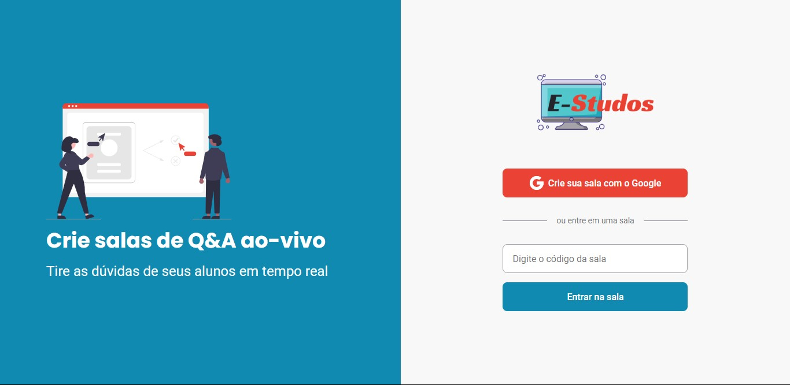

<h1 align="center">
    
</h1>

<br>

## 🧪 Tecnologias

Esse projeto foi desenvolvido com as seguintes tecnologias:

- [React](https://reactjs.org)
- [Firebase](https://firebase.google.com/)
- [TypeScript](https://www.typescriptlang.org/)

## 🚀 Como executar

Clone o projeto e acesse a pasta do mesmo.

```bash
$ git clone https://github.com/IcaroApoloBR/LetmeaskEStudos
$ cd letmeask
```

Para iniciá-lo, siga os passos abaixo:
```bash
# Instalar as dependências
$ yarn

# Iniciar o projeto
$ yarn start
```
O app estará disponível no seu browser pelo endereço http://localhost:3000.

Lembrando que será necessário criar uma conta no [Firebase](https://firebase.google.com/) e um projeto para disponibilizar um Realtime Database.

## 💻 Projeto

E-Studos foi idealizado para criadores de conteúdos poderem criar salas de Q&A com o seu público, de uma forma organizada e democrática. 

Este projeto base foi uma ideia de aplicação apresentada durante a **[Next Level Week Together](https://nextlevelweek.com/)** da Rocketseat.


## 🔖 Layout


## 📝 License

Esse projeto está sob a licença MIT. Veja o arquivo [LICENSE](LICENSE) para mais detalhes.

---

Feito com 💜 por Ícaro Apolo.
